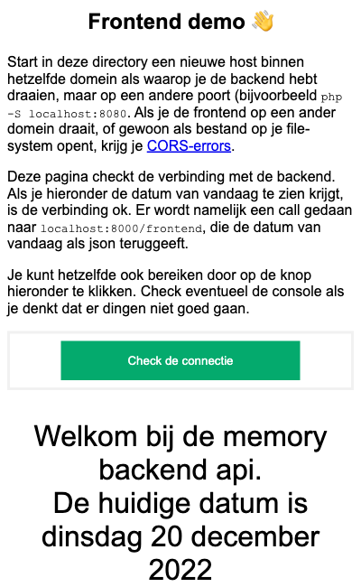

# Memory Backend

Een php/symfony applicatie om te gebruiken voor het opslaan van spelers en spellen van het javascript memory spel. Het is de bedoeling dat je *alleen* aan de frontend werkt. We hebben die backend juist gemaakt om de situatie te simuleren waarin je als developer geen mogelijkheid hebt om een deel van de applicatie (deze backend in dit geval) zelf aan te passen. Dat gezegd hebbende is het best mogelijk dat je dingen in de backend tegenkomt die echt beter moeten. We hebben dat ding redelijk snel in elkaar gezet, dus we doen geen enkele garantie over hoe goed het is. Het staat je dus zeker vrij om dit aan te passen en een pull-request te doen.

We maken bij deze applicatie gebruik van [de LexikJWTAuthenticationBundle](https://github.com/lexik/LexikJWTAuthenticationBundle). Bekijk eventueel de code om te onderzoeken hoe dat ding werkt.

## Installatie en opstarten

Clone deze repository ergens op je lokale machine. Installeer vervolgens de dependencies met behulp van composer. De applicatie maakt gebruik van een sqlite3 database en doctrine. Pas eventueel de gegevens aan in de configuratie om een ander pad naar de database in te stellen. Tenslotte kun je met de console de corresponderende tabellen aanmaken. Uiteindelijk `cd` je in de directory `public` en kun je de server opstarten.

```shell
# installatie van de dependencies
php composer.phar install #of composer install

# opzetten van de database
php bin/console doctrine:schema:update --force

#runnen van de app
cd public
php -S localhost:8000
```

### Backend draaien met docker

```shell
# Bouwen en taggen image
docker build . -t memory-backend
# Runnen van docker image
docker run -p 8000:8000 -d -v memory-backend-data:/usr/src/memory-backend/var --name memory-backend memory-backend
```

## PDO foutmelding

Mocht je de foutmelding krijgen dat er een PDO-dependecy niet gevonden kan worden, dan moet je de `php.ini` aanpassen, zodat de extensies `pdo-sqlite3`, `sodium` en `sqlite3` gevonden kunnen worden.

__Let op__: om het runnen van de applicatie wat eenvoudiger te maken, hebben we zowel de private als de publieke sleutel in git gezet (in `config/jwt`). Dit is natuurlijk niet zoals het hoort, want je moet nooit je private sleutel in versiebeheer zetten. Je kunt natuurlijk altijd zelf een private en publieke sleutel maken, mocht je dat willen. Bekijk eventueel [deze documentatie](https://digitalfortress.tech/php/jwt-authentication-with-symfony/) om te zien hoe je één en ander helemaal goed opzet.

## Het vullen van de database

Het database-schema is vrij eenvoudig van opzet: er is een tabel `player` en een tabel `game` (die op een wat ingewikkelde manier met elkaar verbonden zijn: zie [deze blog om te lezen waarom](https://www.doctrine-project.org/projects/doctrine-orm/en/latest/reference/association-mapping.html#one-to-many-unidirectional-with-join-table)). Check de entiteiten in `App/Entity/` om een beeld te krijgen van hoe deze twee zich tot elkaar verhouden.

In de directory `create` vind je een aantal scripts (eigenlijk gewoon `cURL` calls) die je kunnen helpen met het opzetten en testen van de applicatie. Als je de server hebt draaien kun je deze scripts op de hieronder gegeven volgorde draaien om spelers en spellen aan te maken. Hierbij wordt er van uitgegaan dat de applicatie draait op `localhost:8000`. Als je het ergens anders draait, moet je vanzelfsprekend de nodige gegevens aanpassen.

bestandsnaam | omschrijving
----|----
`create_users.sh`  | Om een aantal spelers in de database aan te maken
`create_games.sh`  | Om een aantal spellen in de database op te slaan

Hierna kun je checken of het inloggen werkt. Als je een speler of een admin inlogt, krijg je van de applicatie een JWT terug. Sla deze op in respectievelijk `player_token` en `admin_token` zodat je de onderstaande scripts kunt gebruiken om te checken of alles goed werkt. Bestudeer ook de scripts zelf om inzicht te krijgen in de API's.

In de code is hard geprogrammeerd dat de gebruiker met gebruikersnaam 'Henk' de `ROLE_ADMIN` heeft.

bestandsnaam | omschrijving
----|----
`login_player.sh`  | Om een speler in te loggen; sla het teruggegeven jwt op in het bestand `player_token`
`check_player.sh`  | Om het jwt van een ROLE_USER te checken
`change_prefs.sh`  | Om de voorkeuren van een speler aan te passen
`login_admin.zsh`  | Om een administrator in de loggen; sla het teruggegeven jwt op in het bestand `player_token`
`check_admin.sh`   | Om het jwt van een ROLE_ADMIN te checken
`failed_login_user.sh`  | Om een speler met verkeerde credentials te checken

## Connectie maken vanaf een frontend

In deze repository vind je ook een directory `frontend`, met daarin één pagina: `index.html`. Deze pagina kun je gebruiken om je setup te checken. Start in deze directory een locale server op die naar een *andere poort* dan de backend zelf luistert (bijvoorbeeld poort 8080).

```shellΩ
# in de directory frontend
php -S localhost:8080
```

Om vanaf een frontend connectie te maken met deze backend is het noodzakelijk om de frontend in hetzelfde domein te hebben draaien als de backend; als je de frontend op een ander domein draait, of gewoon als bestand op je file-system opent, krijg je [CORS-errors](https://developer.mozilla.org/en-US/docs/Web/HTTP/CORS/Errors).


Ga vervolgens met een browser naar `localhost:8080/`. Als het goed is zie je nu een test-pagina. Klik op de knop om de connectie te testen. Hiermee wordt een call gedaan naar `localhost:8000/frontend` die de huidige datum teruggeeft. De test-pagina toont vervolgens deze datum onder het formulier:




## End-points

De applicatie heeft de volgende end-points. Ze spreken redelijk voor zich, maar bestudeer eventueel de Controllers en [de gegenereerde documentatie](http://localhost:8000/api/docs).

### ANONYMOUS

Methode en end-point | return value | omschrijving
----|----|----
`GET /scores` |  200 Ok | Overzicht van de spelers en hun score (ongesorteerd)
`POST /register` | 201 Created | Registeren van een speler
" | 400 Illegal Request | Als de opgestuurde gegevens niet kloppen met het model
`POST /api/login_check` | 200 Ok | Als de credentials kloppen met de speler, komt hier een JWT terug
" | 401 Unauthorized | Als de credentials niet kloppen (specifiek password niet bij username)
`POST /game` | 201 Created | Opslaan van game voor speler
" | 400 | Als request niet overeenkomt met het model

### ROLE_USER

Methode en end-point | return value | omschrijving
----|----|----
`GET /api/player/{id}` | 200 Ok | Alle gegevens van speler `id`
" | 404 Not Found | Als de `id` niet gevonden is
`GET /api/player/{id}/games` | 200 Ok | De spellen die de speler met `id` heeft gespeeld
" | 404 Not Found | Als de `id` niet gevonden is
`GET /api/player/{id}/preferences` | 200 Ok | De voorkeuren van speler `id` (api en kleuren voor gesloten en gevonden kaarten)
" | 404 Not Found | Als de `id` niet gevonden is
`POST /api/player/{id}/preferences` | 204 No Content | Aanpassen van de voorkeuren van speler `id` (api en kleuren voor gesloten en gevonden kaarten)
" | 404 Not Found | Als de `id` niet gevonden is
`GET /api/player/{id}/email` | 200 Ok | Het email-adres van speler `id`
" | 404 Not Found | Als de `id` niet gevonden is
`PUT /api/player/{id}/email` | 204 No Content | Aanpassen van het email=adres van speler `id`
" | 404 Not Found | Als de `id` niet gevonden is

### ROLE_ADMIN

Methode en end-point | return value | omschrijving
----|----|----
`GET /api/admin/aggregate` | 200 Ok | Totaal aantal gespeelde spellen en spelers; overzicht van de gekozen api's
`GET /api/admin/players` | 200 Ok | Overzicht van gebruikersnamen en email-adressen van alle spelers
`GET /api/admin/dates` | 200 Ok | Totaal van het aantal gespeelde spelletjes per dag

## Logging

De applicatie maakt gebruik van [monolog](https://github.com/Seldaek/monolog) voor het bijhouden van log-bestanden. De logs worden bijgehouden in `var/log/`. In totaal zijn vier verschillende logs gedefinieerd:

naam | omschrijving
----|----
`dev` | hierin komen alle meldingen (met niveau `INFO` of hoger) te staan
`request` | de requests met de gevonden route (zo die er is)
`monolog` | alle gebeurtenissen op de database (vanaf level `INFO`)
`error` | alle foutmelden die door de applicatie worden gegenereerd

Om de leesbaarheid van de logs wat te vergroten wordt de volledige melding wat gekort. Het standaard-formaat is `datetime \t request \t message`. Dit gebeurt in de klasse `src\Util\CustomFormatter`. Bestudeer de code in deze klassen wanneer je het formaat toch nog anders wilt hebben. De logs zelf zijn gedefinieerd in `config/packages/monolog.yaml`.
